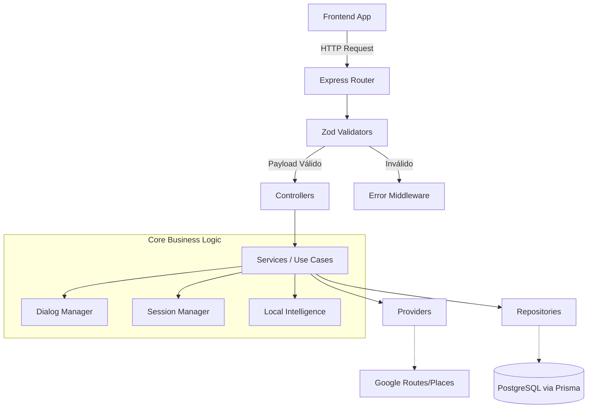
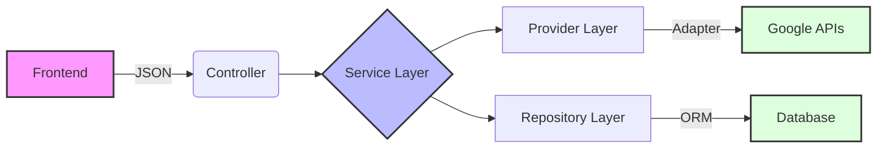

# Arquitetura do Sistema

A arquitetura do projeto Nuvem adota a abordagem de **Monólito Modular** no backend e uma estrutura baseada no **Expo Router** (File-based Routing) no frontend. O design do sistema é severamente influenciado pelos princípios da **Clean Architecture**, embora implementado de maneira pragmática para a escala atual da equipe.

## 1. Visão Arquitetural de Alto Nível

O sistema opera na topologia clássica Cliente-Servidor.

1. **Frontend (App Mobile):** Atua como um terminal burro inteligente. Captura o áudio/texto do usuário, reproduz fala gerada e exibe telas. Não possui regras de negócio complexas de rotas.
2. **Backend (API Node.js):** O núcleo da inteligência. Mantém o controle de estado da conversa, valida limites de uso diário, conecta aos provedores do Google e orquestra a resposta para o frontend.
3. **Database (PostgreSQL):** Persiste dados permanentes de usuário, logs de consumo e as sessões conversacionais temporárias.
4. **Provedores Externos:** APIs do Google Platform (Routes, Places, Maps, Geocoding, Speech).

## 2. Paradigma do Sistema: O Backend Direciona a UI

Um pilar central desta arquitetura, chamado de Server-Driven UI (SDUI) parcial, é que o backend controla **o que** o frontend deve fazer.
As respostas do backend (`conversational.mapper.js`) contêm contratos estruturados:
- `speechText`: O que o app deve falar.
- `screen`: Qual tela renderizar.
- `expectedInput`: Se deve ligar o microfone ou não.
- `conversationState`: O estado lógico atual.

## 3. Arquitetura do Backend

O backend está organizado em módulos verticais em `src/modules` (ex: `users`, `journeys`, `auth`) e funcionalidades horizontais em `src/shared` (Middlewares, Providers de criptografia, Repositórios base).

### Camadas por Módulo

Para cada módulo, respeitamos o isolamento de camadas:

1. **Routes (`*.routes.js`):** Expõem os endpoints HTTP. Unem Middlewares de Autenticação e Validação aos Controllers.
2. **Middlewares / Validators (`*.validator.js`):** Utilizam a biblioteca Zod para validar a entrada (Body, Params, Headers) ANTES de bater no controller, protegendo o sistema contra payload malicioso.
3. **Controllers (`*.controller.js`):** Ponto de entrada das regras. Lidam estritamente com objetos `req` e `res`. Extraem os dados, repassam ao Service e formatam a resposta/código HTTP (200, 400).
4. **Services (`*.service.js`):** A **Camada de Aplicação**. Contém os Casos de Uso (ex: `planJourney`, `handleConversationCommand`). Eles orquestram Repositories, Providers e Mappers. Nunca enxergam objetos HTTP (`req` / `res`).
5. **Providers (`*.provider.js`):** Camada de Infraestrutura/Adapters. Isola chamadas externas (ex: `googlePlaces.provider.js`). O core não deve saber como o Google funciona, apenas interage com a interface abstrata do Provider.
6. **Repositories (`*.repository.js`):** Camada de acesso a dados (Prisma). Centraliza toda e qualquer comunicação com o banco de dados.
7. **Mappers (`*.mapper.js`):** Transformam os DTOs de Infraestrutura em respostas limpas e retrocompatíveis para o frontend.

### Componentes Core da Jornada Voice-First

- **Dialog Manager (`dialog.manager.js`):** FSM (Finite State Machine). Processa um evento baseado no estado atual da conversa e determina o próximo estado lógico (Ex: Estou em `IDLE`, recebi destino -> Vou para `WAITING_CONFIRMATION`).
- **Session Manager (`session.manager.js`):** Abstrai onde a conversa está sendo armazenada (Em Memória ou PostgreSQL). Possui TTL de limpeza.
- **Local Intelligence (`local-intelligence.service.js`):** Aplica regras locais e resolve sinônimos e apelidos da cidade (Uberaba) de forma hardcoded e rápida.

## 4. Arquitetura do Frontend

O aplicativo utiliza o framework Expo com React Native.

- **`app/`:** Contém a navegação (Expo Router). Cada arquivo é uma rota (`inicio.tsx`, `confirmar-destino.tsx`).
- **`src/components/`:** Componentes visuais burros e reaproveitáveis (Botões, Inputs, Cards de Rota, Visualizadores de Voz).
- **`src/services/`:** Contém os clientes de comunicação (`api.ts`, `speech.service.ts`, `journey.service.ts`). O frontend também abstrai chamadas às próprias APIs nativas do celular (Vibração, Permissão de Mic).
- **`src/hooks/`:** Abstração de lógicas complexas de UI (ex: `useVoiceConversationLoop.ts`).
- **`src/contexts/`:** Contextos React para estado global de Acessibilidade.

## 5. Diagramas Arquiteturais

### 5.1 Diagrama de Componentes (Backend)

### 5.2 Arquitetura Lógica de Isolamento

## 6. Fluxo de Comunicação e Dependências

- O frontend comunica-se exclusivamente com a API via chamadas HTTPS.
- A API conecta-se ao Banco (PostgreSQL) usando pool de conexões do Prisma.
- A API faz chamadas de rede externas (Axios) exclusivas para os serviços Cloud do Google (GCP).
- **Dependência Crítica:** O banco de dados para autenticação e logs; O provedor do Google para geolocalização e rotas. Uma falha de infraestrutura no Google resultará em degradação completa da funcionalidade de rota, mas o sistema responderá de forma limpa pelo `Error Middleware`.
