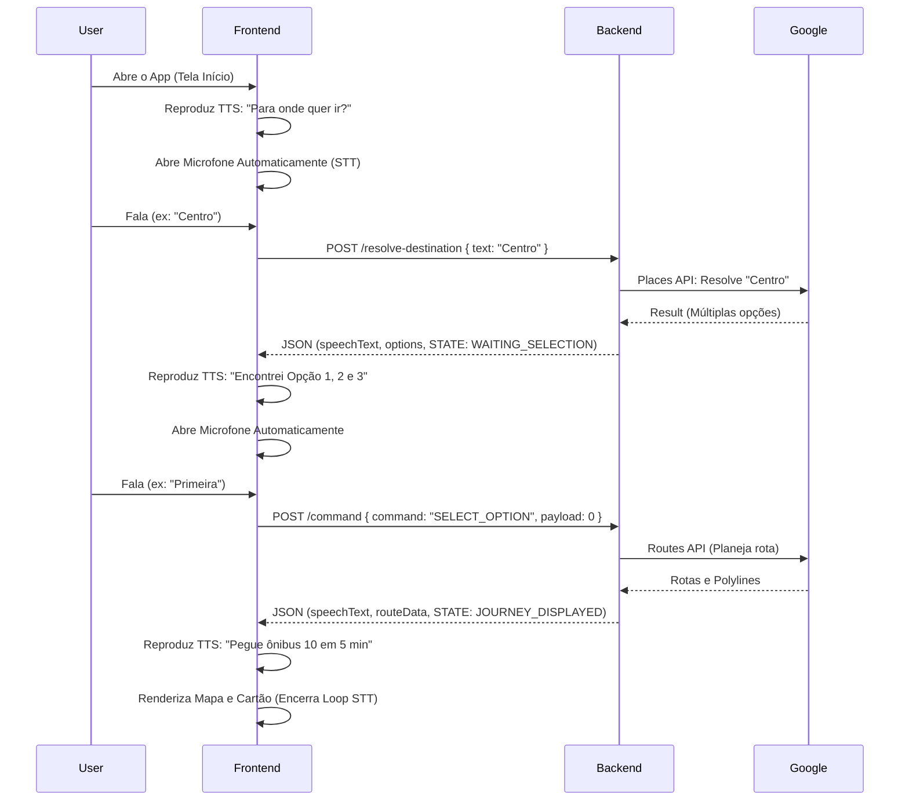
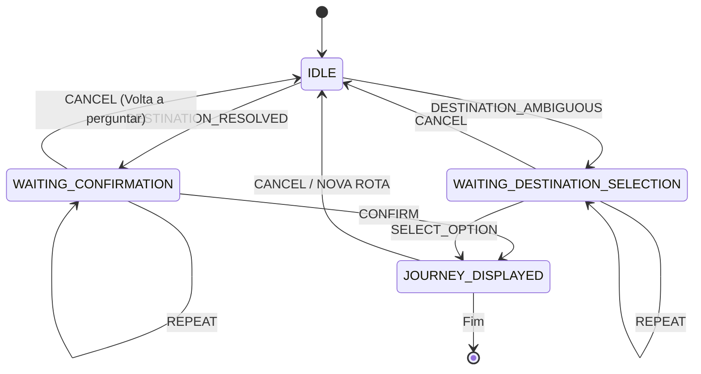

# Fluxos do Sistema

Este documento descreve visualmente e logicamente as jornadas completas dos usuários dentro da arquitetura do Nuvem.

## 1. Fluxo Principal Conversacional (Voice-First Loop)

Este é o fluxo primário (Caminho Feliz). O usuário interage puramente via voz, com a interface agindo como suporte.

## 2. Máquina de Estados Finita (Diagrama de Estados do Backend)

## 3. Fluxo de Falha / Fallback

Se houver ruído, falta de permissão ou preferência pessoal, o usuário migra para o Toque (Touch Fallback).

### 3.1 Exemplo: Microfone Negado ou Ambiente Ruidoso
1. O usuário nega permissão de microfone.
2. O App exibe o Fallback de texto na tela `inicio.tsx`.
3. Usuário digita "Hospital".
4. App requisita `POST /resolve-destination`.
5. Backend devolve as `options` + `speechText`.
6. App **fala** o resultado (TTS ativado) mas **não** abre o microfone, ou abre mas a transcrição falha por ruído contínuo.
7. Usuário toca na opção listada na UI.
8. Frontend processa como se fosse comando e requisita `/journeys/plan` ou `/command`.

## 4. Fluxos de Timeout e Retry de Voz

No Frontend, o hook `useVoiceConversationLoop`:
- Aguarda `X` segundos de silêncio.
- Se nenhuma voz for identificada, o loop incrementa um contador local.
- No limite (ex: 3 vezes), o sistema encerra a escuta e retorna para `idle` para evitar loops infinitos ("battery drains" ou travamento), deixando apenas a interface visual.

## 5. Cancelamentos e Retorno ao Início (Voice Command: "Não")

Caso a assistente pergunte: *"Você quis dizer Praça Rui Barbosa?"* e o usuário diga *"Não"*, o fluxo é:
1. `VoiceIntentParser` interpreta "não".
2. Transforma em comando virtual `CANCEL_AND_ASK_DESTINATION`.
3. Envia o `CANCEL` para o Backend limpar a FSM.
4. O Frontend recomeça a jornada do zero falando: *"Certo, para onde vamos?"*.
