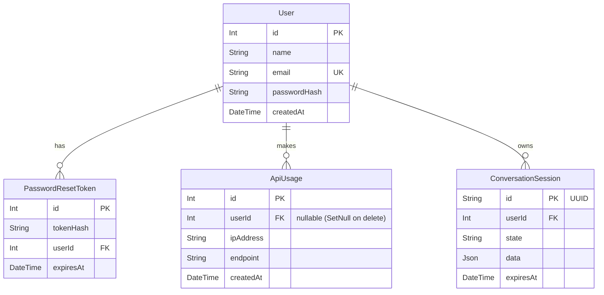

# Banco de Dados (Database)

A persistência do Nuvem baseia-se em PostgreSQL com modelagem orquestrada pelo Prisma ORM. O design prioriza estabilidade para logs de segurança, dados de autenticação e proteção financeira.

## 1. Tabelas e Relacionamentos Principais

### `User` (Usuários)
Responsável pelos dados fundamentais dos usuários da plataforma.
- `id`: Int, Primary Key.
- `name`: Nome de exibição.
- `email`: Identificador único (Unique Index) para login.
- `passwordHash`: Hash gerado com `bcrypt`. Nenhuma senha trafega pura.
- `role`: Autorização base (Padrão: USER).

### `PasswordResetToken`
Sistema efêmero para recuperação de senhas esquecidas.
- `id`: Int, Primary Key.
- `tokenHash`: Token seguro persistido.
- `userId`: Relacionamento 1:N com `User` (onDelete: Cascade).
- `expiresAt`: Data de expiração obrigatória do token para segurança.

### `ApiUsage` (Proteção Financeira)
Auditoria obrigatória para as chamadas a APIs pagas (como Google Routes). O middleware avalia essa tabela para travar acessos além do limite diário.
- `id`: Int.
- `userId`: Relacionamento com `User`. `onDelete: SetNull` para manter os registros de consumo anonimizados mesmo após LGPD (Delete Account).
- `ipAddress`: Endereço de IP (fallback limitador).
- `endpoint`: API acessada.
- `createdAt`: Timestamp. Índices criados para filtragem rápida do "hoje".

### `ConversationSession` e `ConversationTurn` (Visão de Integração)
Gerenciamento de conversas em curso.
- Armazena as chaves temporárias (`sessionId`, `userId`).
- Possui campos de controle de estado FSM (ex: `currentState`).
- Data de expiração/TTL configurada automaticamente para limpeza via scripts ou cron.

### `RouteCache` (Tabela Legada)
Mantida por retrocompatibilidade de histórico, armazenava requisições pesadas de JSON para o Google. Nas versões recentes (desde ADR-015), o cache passou para memória (LRU ou instancial) para evitar gargalos de I/O de rede desnecessários no banco de dados para tempos de cache curtos (ex: 2 min).

## 2. Abordagem ORM

- **Por que Prisma?** Segurança na tipagem estrita no TypeScript (se houver, e IntelliSense no VSCode), geração de migrações simplificadas e adapters otimizados.
- **Regra de Acesso:** Proibido injetar `PrismaClient` diretamente em Controllers ou Services. Todas as leituras e gravações passam pelos Repositories (`users.repository.js`, `apiUsage.repository.js`).

## 3. Diagrama Entidade-Relacionamento (ER)

## 4. Evolução Futura
As próximas iterações do Banco de Dados focarão no módulo de **LocalIntelligence** (`CityConfig`, `AliasConfig`) transferindo as regras hardcoded de apelidos geográficos de memória para banco, permitindo cadastro dinâmico via Painel Administrativo.
